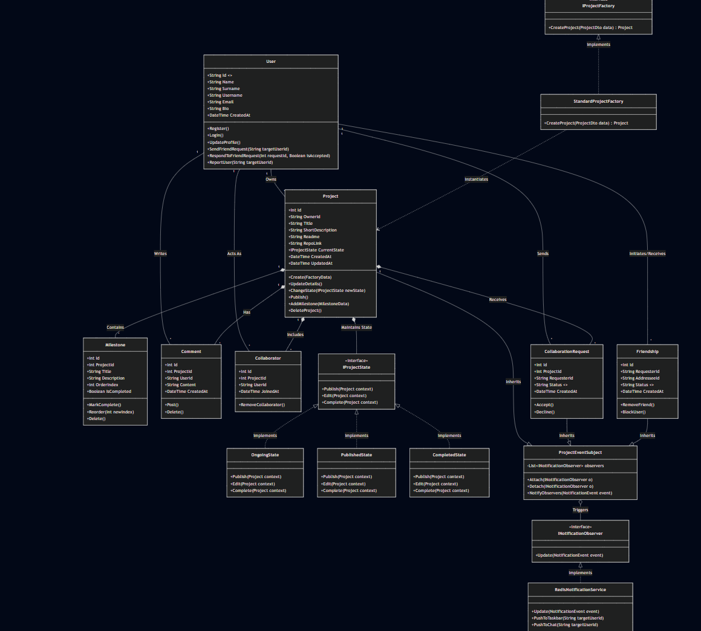

# MzansiBuilds: Enterprise Architecture & Technical Vision Report

**Prepared By:** Genius Muzama  
**Project:** Derivco Code Skills Quest  

---

## 1. Introduction
MzansiBuilds is a unified "build in public" enterprise web platform designed to help developers track their projects, share milestones, and collaborate in real-time. This proposal serves as a roadmap for the software structure, deployment, and scaling of the application. The system provides seamless project management, live developer feeds, and robust collaboration tools, transitioning from a basic concept to a highly scalable, service-oriented environment. By leveraging decoupled backend APIs, robust design patterns, and containerized deployment, the system ensures data integrity, high availability, and scalability.

## 2. Architectural Framework Strategy (TOGAF)
To structure the development of MzansiBuilds, The Open Group Architecture Framework (TOGAF) is utilized. The Architecture Development Method (ADM) provides a step-by-step migration roadmap, of which this proposal covers the first four phases.

### Phase A: Architecture Vision
The "Architecture Vision" phase is where the overall vision is created by defining scope goals, objectives, and high-level requirements.
* **Objective:** Build a centralized platform for developers to share progress and collaborate.
* **Scope:** Includes user account management, project tracking with milestones, a live feed of developer activity, and a "Celebration Wall" for completed projects.
* **Requirements:** Meet all core Derivco Skills Quest competencies, including Test-Driven Development, Secure By Design principles, and the ethical use of AI.

### Phase B: Business Architecture
This phase involves aligning business goals with architectural design, creating models representing business functions/processes to ensure the IT solution supports business objectives.
* **User Journeys:** Users navigate a strict digital pipeline to register, create projects, and request collaboration.
* **Business Rules:** A user cannot add milestones to a project unless they are the owner or an approved collaborator. Code repositories and live chats are protected by strict session management.

### Phase C: Information Systems Architectures
This phase is for designing data flow models to reduce redundancy and structuring applications to meet business needs efficiently.
* **Data Architecture:** A robust relational SQL database will manage the complex relationships between Users, Projects, Milestones, and Comments with absolute data integrity and zero redundancy.
* **Application Architecture:** The software is structured using a strict Service-Oriented Architecture (SOA) where an independent C# Web API handles all data transactions and integrates with Redis for real-time notification caching.

### Phase D: Technology Architecture
The "Technology Architecture" phase defines the IT infrastructure required to support the systems, ensuring scalability and security.
* To support global reach and high availability, the infrastructure utilizes a Cloud-Native, containerized environment using Docker.
* This ensures secure, scalable, and consistent environments across Development, Testing, and Production.

---

## 3. CI/CD Pipeline & Version Control
The MzansiBuilds repository utilizes an iterative Git workflow to ensure high code quality and seamless collaboration.
* **Branching Strategy:** The repository is split into isolated branches for development, testing, and deployment.
* **GitHub Actions:** Automated CI/CD pipelines are triggered on pull requests. Code must pass automated unit tests (Test-Driven Development) and security checks before moving from the development phase into the testing and deployment phases.

---

## 4. Software Design & UML Modelling
To ensure the codebase is maintainable, decoupled, and robust, the application adheres to SOLID principles and implements specific Gang of Four (GoF) design patterns.

* **The State Pattern (Behavioural):** Projects have strict lifecycles (Ongoing, Published, Completed). The state pattern will eliminate complex, fragile if/else logic by allowing the Project object to alter its behaviour when its internal state changes. For example, only a project in the "Completed" state will be rendered on the Celebration Wall.
* **The Factory Method Pattern (Creational):** The Factory Method centralizes the creation logic, by letting subclasses handle instantiation. This will be used to instantiate standard individual projects versus complex collaborative projects, ensuring the presentation layer is decoupled from data logic.
* **The Observer Pattern (Behavioural):** This is representative of a one-to-many relationship between objects. When a user adds a comment or requests collaboration, the Observer pattern triggers an event that updates the Redis cache, pushing a notification to the project owner's taskbar and chat seamlessly.

---

## 5. Tech Stack & Deployment Strategy
The system is built as a monorepo, engineered for high availability and low latency.

### Core Stack:
* **Frontend:** React (deployed via Vercel for fast, global edge delivery).
* **Backend API:** C# .NET API.
* **Database:** MySQL (Hosted on Aiven) with indexes implemented to retrieve information quickly.
* **Caching & Notifications:** Redis (Hosted on Upstash) to protect the SQL database from being overwhelmed by repetitive read requests.
* **Authentication:** Firebase (coupled with JSON Web Tokens for secure API session management).

### Deployment & Scalability:
* **Docker:** The C# API and database environments are fully Dockerized for portability, ensuring anyone pulling the repository can run the application seamlessly regardless of their local environment.
* **API Hosting:** Render (hosting the Dockerized C# backend).
* **Horizontal Scaling:** The architecture is designed to distribute load by adding more machines/nodes to the system if traffic spikes, utilizing a load balancer to handle all traffic routing.